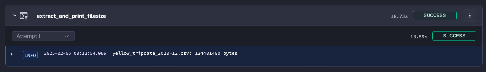
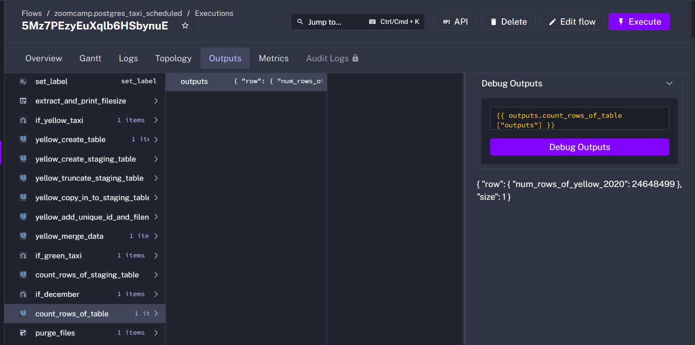
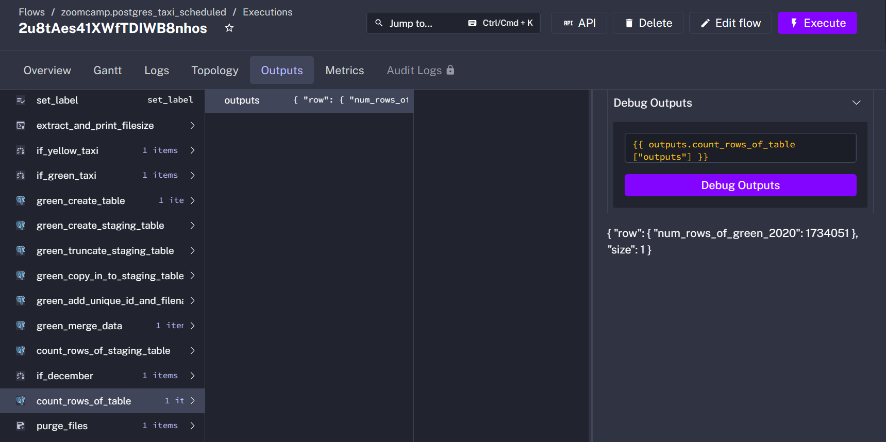
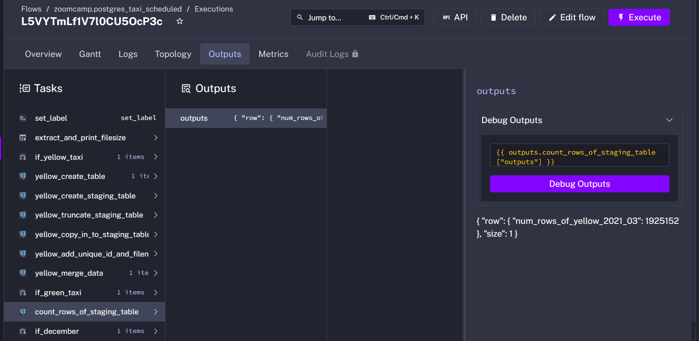

# Module 2 Homework
https://github.com/DataTalksClub/data-engineering-zoomcamp/blob/main/cohorts/2025/02-workflow-orchestration/homework.md

## Get Started
To get the answers to the following questions, one should import the flow `hw2-flow.yaml` into Kestra and backfill the flow between January 1st 2020 and July 31th 2021.

The flow `hw2-flow.yaml` is modified from `02_postgres_taxi_scheduled.yaml` but with these differences:

### Print file size after the file is extracted
Add bash command `stat --printf='%n: %s bytes' {{render(vars.file)}}` to obtain the bytes of csv files.

```yaml
variables:
  # ...
  data: "{{outputs.extract_and_print_filesize.outputFiles[inputs.taxi ~ '_tripdata_' ~ (trigger.date | date('yyyy-MM')) ~ '.csv']}}"

tasks:
    - id: extract_and_print_filesize
    # ...
    commands:
      - wget -qO- https://github.com/DataTalksClub/nyc-tlc-data/releases/download/{{inputs.taxi}}/{{render(vars.file)}}.gz | gunzip > {{render(vars.file)}}
      - "stat --printf='%n: %s bytes' {{render(vars.file)}}"
```

### Print number of rows of tables
Before purging files, the flow queries the database to obtain the row counts of the monthly staging table. If the month of the logical date is December, the flow queries for the total row number from the taxi_data table.

```yaml
tasks:
    # ...
  - id: count_rows_of_staging_table
    type: io.kestra.plugin.jdbc.postgresql.Queries
    fetchType: FETCH_ONE
    sql: |
      SELECT COUNT(*) AS num_rows_of_{{inputs.taxi}}_{{trigger.date | date('yyyy_MM')}}
      FROM {{render(vars.staging_table)}};
  
  - id: if_december
    type: io.kestra.plugin.core.flow.If
    condition: "{{(trigger.date | date('MM')) == '12'}}"
    then: 
      - id: count_rows_of_table
        type: io.kestra.plugin.jdbc.postgresql.Queries
        fetchType: FETCH_ONE
        sql: |
          SELECT COUNT(*) AS num_rows_of_{{inputs.taxi}}_{{trigger.date | date('yyyy')}}
          FROM {{render(vars.table)}};
```


## Question 1
Within the execution for Yellow Taxi data for the year 2020 and month 12: what is the uncompressed file size (i.e. the output file yellow_tripdata_2020-12.csv of the extract task)?
1. 128.3 MB
2. 134.5 MB
3. 364.7 MB
4. 692.6 MB

Ans: 134481400 bytes = 134.5 MB = (2)




## Question 2
What is the rendered value of the variable `file` when the inputs `taxi` is set to `green`, `year` is set to `2020`, and `month` is set to `04` during execution?

1. `{{inputs.taxi}}_tripdata_{{inputs.year}}-{{inputs.month}}.csv` 
2. `green_tripdata_2020-04.csv`
3.  `green_tripdata_04_2020.csv`
4. `green_tripdata_2020.csv`

Ans: (2)

## Question 3
How many rows are there for the `Yellow` Taxi data for all CSV files in the year 2020?
1. 13,537.299
2. 24,648,499
3. 18,324,219
4. 29,430,127

Ans: (2)



## Question 4
How many rows are there for the `Green` Taxi data for all CSV files in the year 2020?
1. 5,327,301
2. 936,199
3. 1,734,051
4. 1,342,034

Ans: (3)




## Question 5
How many rows are there for the `Yellow` Taxi data for the March 2021 CSV file?
1. 1,428,092
2. 706,911
3. 1,925,152
4. 2,561,031

Ans: (3)




## Question 6
How would you configure the timezone to New York in a Schedule trigger?
1. Add a `timezone` property set to `EST` in the `Schedule` trigger configuration  
2. Add a `timezone` property set to `America/New_York` in the `Schedule` trigger configuration
3. Add a `timezone` property set to `UTC-5` in the `Schedule` trigger configuration
4. Add a `location` property set to `New_York` in the `Schedule` trigger configuration 

Ans: (2)

See: https://kestra.io/docs/workflow-components/triggers/schedule-trigger