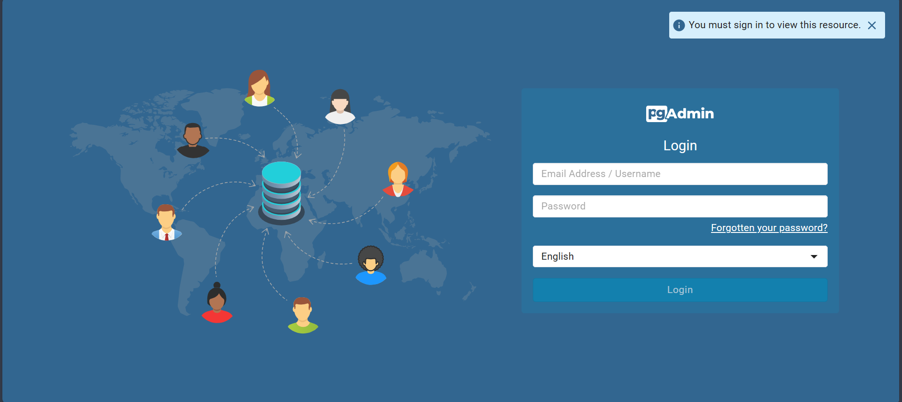

### Table of Content
* [Ingesting NY Taxi Data to Postgres](#122---ingesting-ny-taxi-data-to-postgres)
* [Connecting pgAdmin and Postgres](#123---connecting-pgadmin-and-postgres)

## 1.2.1 - Introduction to Docker
我採用的設定，是透過 wsl 操作 Windows 系統中的 Docker。在開始前，記得啟動 Docker Desktop。

如果想要在 Windows 系統下直接運行 Docker 的話，可以參考此篇 [筆記](./how-to-run-docker-in-primitive-windows.mdhow-to)。

> [!WARNING]
> 遺憾的是，因為後續的章節會透過 Docker 運行 PostgresQL 和 PostgresQL 的圖形使用者介面(GUI) - pgadmin，而二者皆僅提供 Linux 的映像檔 (image)，所以無法在 Windows 系統下跟著課程內容實作。

## 1.2.2 - Ingesting NY Taxi Data to Postgres
[](https://www.youtube.com/watch?v=2JM-ziJt0WI) 


> 在這個單元，我們將會透過 Docker 創建能夠運行 [Postgres Database 的容器](https://hub.docker.com/r/library/postgres)，並將 [NY Taxi](https://www.nyc.gov/site/tlc/about/tlc-trip-record-data.page) 的資料加入 Postgres Database 之中。

### Step 1. Postgres Database From Docker
在 WSL 中，有些步驟跟 Alexey 示範的有些不同。我們首先得在 Docker 中掛載一個 Volume:
```docker
docker volume create --name dtc_postgres_volume_local -d local
```
接著運行容器
```docker
docker run -it  \
    -e POSTGRES_USER="root" \
    -e POSTGRES_PASSWORD="root" \
    -e POSTGRES_DB="ny_taxi" \
    -v dtc_postgres_volume_local:/var/lib/postgresql/data   \
    -p 5432:5432 \
    postgres:13
```

最後測試一下可不可以利用 `pgcli` 跟資料庫後端互動，我們先安裝以下 Python 套件
```shell
pip install pgcli psycopg_binary
```
接著在 shell 裡面執行
```shell
pgcli -h localhost -p 5432 -u root -d ny_taxi
```
### Step 2. NY Taxi Data
因為目前 [NY Taxi](https://www.nyc.gov/site/tlc/about/tlc-trip-record-data.page) 資料的公開格式已經改成 `.parquet`，所以我將原本`.csv`的操作流程，針對`.parquet`做了些許調整。首先，我們先 `pip install` 以下的 Python 套件：
```
pip install pandas sqlalchemy pyarrow psycopg2_binary
```
並到這個[網站](https://www.nyc.gov/site/tlc/about/tlc-trip-record-data.page)下載 2021 年的 Yellow Taxi Trip Records。或者透過命令工具下載資料：
```
wget https://d37ci6vzurychx.cloudfront.net/trip-data/yellow_tripdata_2021-01.parquet
```
接著開啟 jupyter notebook 執行 [upload-data.ipynb]()，你可以直接複製這個檔案並使用它。
注意：我完成這個步驟的時候，將資料和 `upload-data.ipynb` 放置於同一個目錄下。
如果你沒有將資料放在同一個目錄之下，那麼你將需要按照檔案路徑修改 `ipynb` 中的 `pd.read_parquet(<your-data-path>)` 來讀取對應位置的資料。


## 1.2.3 - Connecting pgAdmin and Postgres
[](https://www.youtube.com/watch?v=hCAIVe9N0ow)
[](#table-of-content)

> 在這個小節中，我們開始使用一個為 Postgres 設計的 GUI -- [pgAdmin](https://www.pgadmin.org/download/pgadmin-4-windows/)
來查詢 Postgres 資料庫。

### Step 1. Start using pdAdmin
進入 [pgAdmin](https://www.pgadmin.org/download/pgadmin-4-windows/) 的網站後，點選 Container 就可以看到 pdAdmin 在 DockerHub 的首頁。

我們執行下面的 Docker 指令來運行 pgAdmin 的容器：
```docker
docker run -it \
    -e PGADMIN_DEFAULT_EMAIL="admin@admin.com" \
    -e PGADMIN_DEFAULT_PASSWORD="root" \
    -p 8080:80 \
    dpage/pgadmin4
```
> [!NOTE]
> 在這個步驟我們便可以關閉 pgcli 了。二者本質上而言，都同樣是跟資料庫溝通的介面程式，因此我們擇一即可。

成功下載 Docker image 並運行容器後，我們接著開啟瀏覽器，在網址列輸入`http://localhost:8080/`
順利的話，我們可以在瀏覽器中看到以下的登入頁面。使用剛才運行容器的環境變數 (EMAIL = admin@admin.com, PASSWORD=root)
可以登入控制介面。

|    pgAdmin登入頁面     | pgAdmin 控制介面  |
| :--------------------: | :---------------: |
|  |  |

> [!CAUTION]
> 然而，在這邊 "Add New Server" 輸入 localhost 和對應的 port 居然沒辦法連上 Postgres 資料庫伺服器！

> [!TIP]
> 因為 Postgres 和 pdAdmin 分別在互不連通的容器裡運行，所以我們需要透過 **網路 (network)** 連接二個容器，

### Step 2. Setup Docker network
這邊我們要解決 Step 1 留下的問題。首先輸入以下指令在 Docker 中新增一個網路 `pg-network`
```docker
docker network create pg-network
```
接著運行 postgres 的容器，並在指令中加入剛剛新增的網路和容器的名稱。
```docker
docker run -it  \
    -e POSTGRES_USER="root" \
    -e POSTGRES_PASSWORD="root" \
    -e POSTGRES_DB="ny_taxi" \
    -v dtc_postgres_volume_local:/var/lib/postgresql/data   \
    -p 5432:5432 \
    --network pg-network \
    --name pg-database \
    postgres:13
```

> [!NOTE]  
> **`docker run image`其實是新增一個容器。**<br>
> 在影片中 Alexey 用了想要幫容器取名為 pg-database 但是沒有成功，因為他自己先前運行 (run) 容器已經用掉這個名稱了，如果在這個步驟停下來，隔天重跑一次的朋友可能也會遇到同樣的問題。

> [!TIP]
> 你可以利用 `docker container prune` 將先前新增的容器刪除後再重來。或者透過 `docker start pg-database` 重新啟用容器。

然後，運行 pgadmin 的容器，並在指令中加入剛剛新增的網路和容器的名稱。
```docker
docker run -it \
    -e PGADMIN_DEFAULT_EMAIL="admin@admin.com" \
    -e PGADMIN_DEFAULT_PASSWORD="root" \
    -p 8080:80 \
    --network=pg-network \
    --name pg-admin\
    dpage/pgadmin4
```
> [!TIP]
> 可以透過 `Ctrl+P` `Ctrl+Q` 返回 shell，將 docker 容器保留在背景運行。

### Step 3. Connect Dastabase to GUI
最後在 "Add New Server" 中的 `Gerneral >  Name` 輸入 "Docker localhost"，`Connection` 輸入以下資訊
- `Host Name/address`: pd-database
- `Port`: 5432
- `Maintainence database`: postgres
- `Username`: root
- `Password`: root

如此便完成了容器間的通訊，順利在 pgAdmin 中接入資料庫。
|   Settings - General   |   Settings - Connection   |
| :--------------------: | :-----------------------: |
|  |  |

<br>

## 1.2.4 - Dockerizing the Ingestion Script
[](https://www.youtube.com/watch?v=B1WwATwf-vY)
[](#table-of-content)

> 在這個小節，我們學習如何將 1.2.2 的資料導入 (Data ingestion) 腳本也加入 Docker 中。

### Step 1. 製作 CLI 工具 - `ingest_data.py`
我們可以利用 `jupyter nbconvert` 將 `ipynb` 轉換為 `py` 檔
```shell
jupyter nbconvert --to=script upload-data.ipynb
```
將不需要的程式碼刪除後，我們加入 `argparse` 使我們的 python script 可以輕鬆地接受命令列參數。調整後的 python script 大致如下：
* 利用 `argparse` 解析以下使用者透過輸入的資訊
    * Username
    * Password
    * Host
    * Port
    * Database name
    * Table name
    * URL for the CSV (parquet) file 
* 從上述的 URL 下載資料
* 剩餘的參數用於連接 Postgres database 並將資料匯入資料庫中，程式碼如下所示
```python
engine = create_engine(f'postgresql://{user}:{password}@{host}:{port}/{db}')
```
最後完成的 python script 可以參考這個檔案：[ingest_data.py]()

### Step 2. 製作 Dockerfile
我們能以先前的 Dockerfile 為基礎去修改：
```dockerfile
FROM python:3.9.1

RUN apt-get install wget
RUN pip install pandas sqlalchemy psycopg2_binary pyarrow

WORKDIR /app
COPY ingest_data.py ingest_data.py

ENTRYPOINT [ "python", "ingest_data.py" ]
```


### Step 3. 運行容器

```docker
docker volume create --name dtc_postgres_volume_local -d local
docker run -it  \
    -e POSTGRES_USER="root" \
    -e POSTGRES_PASSWORD="root" \
    -e POSTGRES_DB="ny_taxi" \
    -v dtc_postgres_volume_local:/var/lib/postgresql/data   \
    -p 5432:5432 \
    --network pg-network \
    --name pg-database \
    postgres:13
docker run -it \
    -e PGADMIN_DEFAULT_EMAIL="admin@admin.com" \
    -e PGADMIN_DEFAULT_PASSWORD="root" \
    -p 8080:80 \
    --network=pg-network \
    --name pg-admin\
    dpage/pgadmin4
```

```docker
URL=https://d37ci6vzurychx.cloudfront.net/trip-data/yellow_tripdata_2021-01.parquet
docker build -t taxi_ingest:v001 .
docker run -it \
    --network=pg-network \
    taxi_ingest:v001 \
    --user=root \
    --password=root \
    --host=pg-database \
    --port=5432 \
    --db=ny_taxi \
    --table_name=yellow_taxi_trips \
    --url=${URL}
```

<br>

## 1.2.5 - Running Postgres and pgAdmin with Docker-Compose
[](https://www.youtube.com/watch?v=hKI6PkPhpa0)

>  在這個小節中，我們學習使用 Docker Compose，一次啟動所有與服務相關的程序。

### Step 1. Create `docker-compose.yaml`

新增一個 `docker-compose.yaml` 檔案，並把前面所使用的容器設定都放進去。

值得注意的是，我們在先前掛載 (mount) 的
Docker Volume `dtc_postgres_volume_local` 也需要在這個檔案中的 `volume` 底下列出，並加入屬性 `external: true`
代表已經創建的容器空間，沒有這個屬性的話，Docker 就會當成一個 docker-compose 的內部命名，並在啟動的時候另外建立
一個毫不相干的 Volume 供這組服務使用。

```yaml
services:
  pgdatabase:
    image: postgres:13
    environment:
      - POSTGRES_USER=root
      - POSTGRES_PASSWORD=root
      - POSTGRES_DB=ny_taxi
    volumes:
      - dtc_postgres_volume_local:/var/lib/postgresql/data
    ports:
      - 5432:5432
  pgadmin:
    image: dpage/pgadmin4
    environment:
      - PGADMIN_DEFAULT_EMAIL=admin@admin.com
      - PGADMIN_DEFAULT_PASSWORD=root
    ports:
      - 8080:80

volumes:
  dtc_postgres_volume_local:
    external: true
```

### Step 2. Start and stop services

接著在 shell 中輸入以下指令，一次為所有服務建立並開啟容器。

```shell
docker compose up
```

或者加入選項 `-d` 在背景運行服務。

```shell
docker compose up -d
```

> [!TIP]
> 可以發現一件事：使用 docker-compose 後，我們不需要設定網路了！

> [!NOTE]
> 根據 [Docker Docs](https://docs.docker.com/compose/how-tos/networking/)，我們不需要手動地將容器透過網路串聯， docker-compose 預設便建立一個網路，並把所有使用到的容器加入其中。<br><br>
> "By default Compose sets up a single network for your app. Each container for a service joins the default network and is both reachable by other containers on that network, and discoverable by the service's name."

在 shell 中輸入以下指令，可以關閉所有服務並刪除容器。

```shell
docker compose down
```

> [!NOTE]
> `docker-compose` or `docker compose`? <br><br>
> 在影片中 Alexey 用了 `docker-compose`， 然而這是 Compose V1 的指令，它獨立於 Docker 被開發出來，並在 2023 年 7 月宣布停止所有更新。 `docker compose`則是 Compose V2，它被整合進 Docker 作為 Docker 服務的一部分。因此，使用`docker compose` 會是更好的選擇。 可以參考：[Migrate to Compose V2](https://docs.docker.com/compose/releases/migrate/)<br><br> 

<br><br>

## 6. SQL Resfresher
[](https://www.youtube.com/watch?v=QEcps_iskgg)

#### Step 1. Docker-compose the whole service
在 Youtube 影片中，Alexey 已經預先在 jupyter notebook 中將 zone 這個資料表放進去了。我在這邊採用了一個不同的方法：把前面的 `ingest_data.py` 和他對應的 Dockerfile 稍作調整後，加入 `docker-compose.yaml` 中。

> [!TIP]
> 值得一提的是，`ingest_data` 必須要在 `pgdatabase` 開啟之後才可以導入資料，因此我們要在`ingest_data`底下加入 `depend_on`、`pgdatabase` 底下加入 `healthcheck` 來確保服務的運行順序。具體細節可以參考這個小節的 [docker-compose.yaml](1.2.6%20-%20SQL%20Refresher/docker-compose.yaml)。

#### Step 2. SQL queries
```sql
SELECT
    *
FROM
    trips
LIMIT 100;
```


## 1.3.2 Terraform Basics
https://registry.terraform.io/providers/hashicorp/google/latest/docs/resources/storage_bucket#example-usage---life-cycle-settings-for-storage-bucket-objects


## 1.3.3 - Terraform Variables
