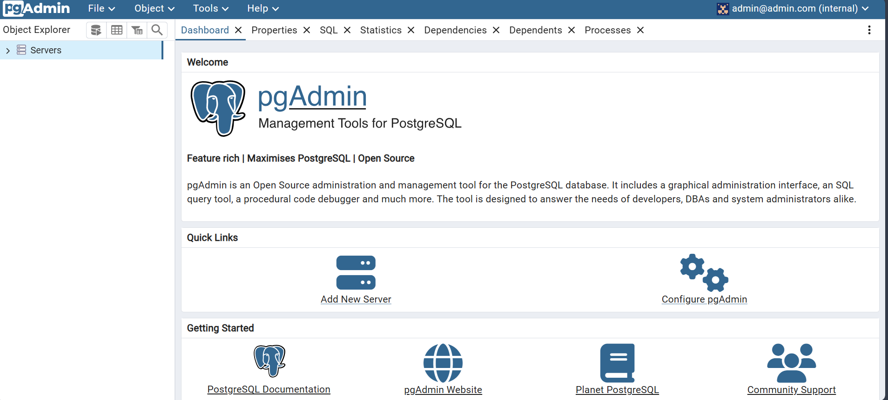
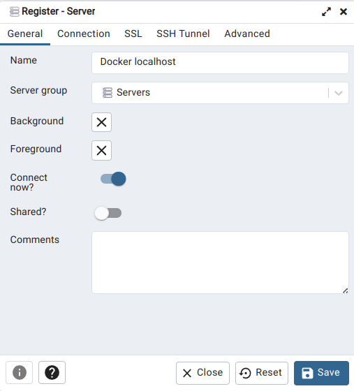
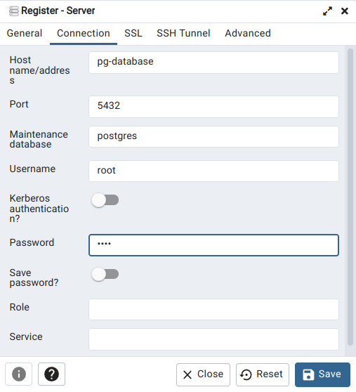

### 1. Introduction to Docker

我採用的設定，是透過 wsl 操作 Windows 系統中的 Docker。在開始前，記得啟動 Docker Desktop。

如果想要在 Windows 系統下直接運行 Docker 的話，可以參考此篇 [筆記](./how-to-run-docker-in-primitive-windows.mdhow-to)。

> [!WARNING]
> 遺憾的是，因為後續的章節會透過 Docker 運行 PostgresQL 和 PostgresQL 的圖形使用者介面(GUI) - pgadmin，而二者皆僅提供 Linux 的映像檔 (image)，所以無法在 Windows 系統下跟著課程內容實作。

### 2. Ingesting NY Taxi Data to Postgres

[](https://www.youtube.com/watch?v=2JM-ziJt0WI)

在這個單元，我們將會透過 Docker 創建能夠運行 [Postgres Database 的容器](https://hub.docker.com/r/library/postgres)，並將 [NY Taxi](https://www.nyc.gov/site/tlc/about/tlc-trip-record-data.page) 的資料加入 Postgres Database 之中。

<details>
<summary>
<h4> Step 1. Postgres Database From Docker </h4>
</summary>

在 WSL 中，有些步驟跟講師示範的有些不同。我們首先得在Docker中掛載一個空間:

```docker
docker volume create --name dtc_postgres_volume_local -d local
```

接著運行容器

```docker
docker run -it  \
    -e POSTGRES_USER="root" \
    -e POSTGRES_PASSWORD="root" \
    -e POSTGRES_DB="ny_taxi" \
    -v dtc_postgres_volume_local:/var/lib/postgresql/data   \
    -p 5432:5432 \
    postgres:13
```

最後測試一下可不可以利用`pgcli`跟資料庫後端互動：

```shell
pgcli -h localhost -p 5432 -u root -d ny_taxi
```

> [!NOTE]
> 我們需要以下套件 Dependencies：
>
> - pgcli
> - psycopg_binary

</details>

<details>
<summary>
<h4> Step 2. NY Taxi Data </h4>
</summary>

因為目前 [NY Taxi](https://www.nyc.gov/site/tlc/about/tlc-trip-record-data.page) 資料的公開格式已經改成 `.parquet`，所以我將原本`.csv`的操作流程，針對`.parquet`做了些許調整。

> [!NOTE]
> 我們需要以下套件 Dependencies：
>
> - pandas
> - sqlalchemy
> - pyarrow
> - psycopg2_binary

</details>

### 3. Connecting pgAdmin and Postgres

[](https://www.youtube.com/watch?v=hCAIVe9N0ow)

<details>
<summary>
<a href="https://youtu.be/hCAIVe9N0ow?si=TsMgA-X8Iwm3jUPM&t=127"> <h4> Step 1. Start using pdAdmin </h4> </a>
</summary>

在這個小節中，我們開始使用一個為 Postgres 設計的 GUI -- [pgAdmin](https://www.pgadmin.org/download/pgadmin-4-windows/)
來查詢 Postgres 資料庫。進入網站後，點選 Container 就可以看到 pdAdmin 在 DockerHub 的首頁。

我們執行下面的 Docker 指令來運行 pgAdmin 的容器：

```docker
docker run -it \
    -e PGADMIN_DEFAULT_EMAIL="admin@admin.com" \
    -e PGADMIN_DEFAULT_PASSWORD="root" \
    -p 8080:80 \
    dpage/pgadmin4
```

> [!NOTE]
> 在這個步驟我們便可以關閉 pgcli 了。二者本質上而言，都同樣是跟資料庫溝通的介面程式，因此我們擇一即可。

成功下載 Docker image 並運行容器後，我們接著開啟瀏覽器，在網址列輸入`http://localhost:8080/`
順利的話，我們可以在瀏覽器中看到以下的登入頁面。使用剛才運行容器的環境變數 (EMAIL = admin@admin.com, PASSWORD=root)
可以登入控制介面。

|    pgAdmin登入頁面     | pgAdmin 控制介面  |
| :--------------------: | :---------------: |
|  |  |

> [!CAUTION]
> 然而，在這邊 "Add New Server" 輸入 localhost 和對應的 port 居然沒辦法連上 Postgres 資料庫伺服器！

> [!TIP]
> 因為 Postgres 和 pdAdmin 分別在互不連通的容器裡運行，所以我們需要透過 **網路 (network)** 連接二個容器，

</details>

<details>
<summary>
<a href="https://youtu.be/hCAIVe9N0ow?si=TsMgA-X8Iwm3jUPM&t=127"> <h4> Step 2. Docker network </h4> </a>
</summary>

首先輸入以下指令在 Docker 中新增一個網路 `pg-network`

```docker
docker network create pg-network
```

接著運行 postgres 的容器，並在指令中加入剛剛新增的網路和容器的名稱。

```docker
docker run -it  \
    -e POSTGRES_USER="root" \
    -e POSTGRES_PASSWORD="root" \
    -e POSTGRES_DB="ny_taxi" \
    -v dtc_postgres_volume_local:/var/lib/postgresql/data   \
    -p 5432:5432 \
    --network pg-network \
    --name pg-database \
    postgres:13
```

> [!NOTE]  
> **`docker run image`其實是新增一個容器。**<br>
> 在影片中 Alexey 用了想要幫容器取名為 pg-database 但是沒有成功，因為他自己先前運行 (run) 容器已經用掉這個名稱了，如果在這個步驟停下來，隔天重跑一次的朋友可能也會遇到同樣的問題。

> [!TIP]
> 你可以利用 `docker container prune` 將先前新增的容器刪除後再重來。或者透過 `docker start pg-database` 重新啟用容器。

然後，運行 pgadmin 的容器，並在指令中加入剛剛新增的網路和容器的名稱。

```docker
docker run -it \
    -e PGADMIN_DEFAULT_EMAIL="admin@admin.com" \
    -e PGADMIN_DEFAULT_PASSWORD="root" \
    -p 8080:80 \
    --network=pg-network \
    --name pg-admin\
    dpage/pgadmin4
```

> [!TIP]
> 可以透過 `Ctrl+P` `Ctrl+Q` 返回 shell，將 docker 容器保留在背景運行。

最後在 "Add New Server" 中的 `Gerneral >  Name` 輸入 Docker localhost，`Connection`輸入以下資訊

- `Host Name/address`: pd-database
- `Port`: 5432
- `Maintainence database`: postgres
- `Username`: root
- `Password`: root

|   Settings - General   |   Settings - Connection   |
| :--------------------: | :-----------------------: |
|  |  |

便完成了容器間的通訊，順利在 pgAdmin 中接入資料庫。

</details>

### 4. Dockerizing the Ingestion Script

在這個小節，我們學習如何將 1.2.2 的資料導入 (Data ingestion) 腳本，也加入 Docker 中。

#### 製作 CLI 工具 - ingest.py

#### 製作 Dockerfile

#### 運行容器

```docker
docker volume create --name dtc_postgres_volume_local -d local
docker run -it  \
    -e POSTGRES_USER="root" \
    -e POSTGRES_PASSWORD="root" \
    -e POSTGRES_DB="ny_taxi" \
    -v dtc_postgres_volume_local:/var/lib/postgresql/data   \
    -p 5432:5432 \
    --network pg-network \
    --name pg-database \
    postgres:13
docker run -it \
    -e PGADMIN_DEFAULT_EMAIL="admin@admin.com" \
    -e PGADMIN_DEFAULT_PASSWORD="root" \
    -p 8080:80 \
    --network=pg-network \
    --name pg-admin\
    dpage/pgadmin4
```

```docker
URL=https://d37ci6vzurychx.cloudfront.net/trip-data/yellow_tripdata_2021-01.parquet
docker build -t taxi_ingest:v001 .
docker run -it \
    --network=pg-network \
    taxi_ingest:v001 \
    --user=root \
    --password=root \
    --host=localhost \
    --port=5432 \
    --db=ny_taxi \
    --table_name=yellow_taxi_trips \
    --url=${URL}
```

### Docker Compose

新增一個 `docker-compose.yaml` 檔案，並把前面所使用的容器設定都放進去。

```yaml
services:
  pgdatabase:
    image: postgres:13
    environment:
      - POSTGRES_USER=root
      - POSTGRES_PASSWORD=root
      - POSTGRES_DB=ny_taxi
    volumes:
      - dtc_postgres_volume_local:/var/lib/postgresql/data
    ports:
      - 5432:5432
  pgadmin:
    image: dpage/pgadmin4
    environment:
      - PGADMIN_DEFAULT_EMAIL=admin@admin.com
      - PGADMIN_DEFAULT_PASSWORD=root
    ports:
      - 8080:80

volumes:
  dtc_postgres_volume_local:
```

接著在 shell 中輸入以下指令，一次開啟所有容器。

```shell
docker-compose up
```

> [!TIP]
> 使用 docker-compose後，我們不需要設定網路了！

> [!NOTE]
> 根據 [dockerdocs](https://docs.docker.com/compose/how-tos/networking/)，我們不需要手動地將容器透過網路串聯， docker-compose 預設便建立一個網路，並把所有使用到的容器加入其中。<br><br>
> "By default Compose sets up a single network for your app. Each container for a service joins the default network and is both reachable by other containers on that network, and discoverable by the service's name."
