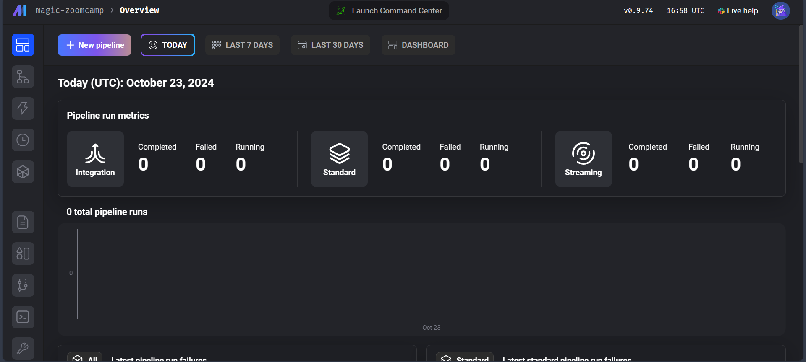

# Version 2024

## 2.2.1 - What is Orchestration
[](https://www.youtube.com/watch?v=Li8-MWHhTbo)
[](#table-of-content)


### 什麼是 Data Orchestration

> 資料工程中的很大一部分，是在不同的資料來源間進行資料的擷取 (Extract)、轉換 (Transform) 和載入 (load)。
> 而資料編排 (Data Orchestration) 就是以自動化的方式管理 ETL 依賴關係的過程。
>
> A large part Of data engineering is extracting, transforming, and loading data between sources.
> Orchestration is a process of dependency management, facilitated through automation.

### Orchestration 處理什麼?

| 功能 | 說明 |
|------|------|
| 工作流程管理<br>(Workflow Management) | - 管理和協調數據處理任務的順序和依賴關係<br>- 確保數據管道(Data Pipeline)中的各個步驟按正確順序執行<br>- 例如：使用Airflow或Dagster等工具安排ETL任務 |
| 自動化<br>(Automation) | - 將重複性的數據處理任務自動化<br>- 減少人工干預，提高效率<br>- 包括自動數據提取、轉換、加載等過程 |
| 錯誤處理<br>(Error Handling) | - 識別和處理數據處理過程中的異常情況<br>- 實現錯誤重試機制<br>- 提供清晰的錯誤日誌和通知 |
| 恢復機制<br>(Recovery) | - 在系統故障後恢復數據處理<br>- 確保數據一致性<br>- 實現檢查點(checkpoint)和備份策略 |
| 監控和警告<br>(Monitoring, Alerting) | - 即時監控數據管道的運行狀況<br>- 設置關鍵指標的警告閾值<br>- 在出現問題時及時通知相關人員 |
| 資源優化<br>(Resource Optimization) | - 優化計算資源的使用<br>- 管理記憶體、CPU等資源的分配<br>- 確保成本效益最大化 |
| 可觀察性<br>(Observability) | - 收集系統運行的詳細資訊<br>- 提供系統行為的深入洞察<br>- 包括日誌、指標和追踪等資訊 |
| 除錯<br>(Debugging) | - 識別和修復程式碼和數據問題<br>- 提供調試工具和環境<br>- 支援即時問題排查和分析 |
| 合規性/審計<br>(Compliance/Auditing) | - 確保數據處理符合法規要求<br>- 記錄和追踪數據訪問歷史<br>- 生成合規性報告和審計日誌 |

### 一個好的解決方案應該考慮什麼? 

| 面向 | 說明 | 範例問題 |
|------|------|----------|
| Flow State<br>(心流狀態) | 開發者能夠持續專注且高效地工作的狀態 | "我需要在7個工具/服務之間切換" <br> - 這說明當前工作流程可能會中斷開發者的心流狀態 |
| Feedback Loops<br>(回饋循環) | 開發者執行操作後獲得回饋的速度和品質 | "我花了5小時在本地測試這個DAG"<br> - 這顯示反饋循環過長，影響開發效率 |
| Cognitive Load<br>(認知負荷) | 開發者需要同時處理和記憶的資訊量 | "要完成工作需要了解多少知識？"<br> - 這關係到系統的學習曲線和使用難度 |

這三個要素形成了一個平衡的三角形，一個好的編排工具應該：
1. 最小化工具切換，保持開發者的心流狀態
2. 提供快速的回饋機制，縮短測試和驗證時間
3. 降低認知負荷，使系統易於理解和使用


## 2.2.2 - What is Mage, Configure Mage, and A Simple Pipeline
> 在這個小節，我們會初步認識 Mage 這個 Data Orchestration 的工具。
> 我們會用 Docker 建置，並透過 Mage 跟 Postgres 資料庫互動

### Configure Mage
在最一開始的階段，我們可以使用 Docker 就可以在很短的時間內將 Mage 運行起來。

1. 我們先到這個 [mage-zoomcamp GitHub repo](https://github.com/mage-ai/mage-zoomcamp) 把資料複製到本機端。
```shell
git clone https://github.com/mage-ai/mage-zoomcamp.git
```
> [!TIP]
> 如果你直接 fork 這個 repo 的話，可以直接從 2. 開始做。

2. 接著我們複製一份到環境變數到 `.env` 這個檔案中
```shell
cp dev.env .env
```
3. 然後 `docker compose up` 開啟服務。
```shell
docker compose up
```
4. 最後我們開啟瀏覽器，在網址列輸入 `localhost:6789` 就可以看到 Mage 的介面。



> [!NOTE]
> 我們可以簡單看一下 `docker-compose.ymal` 來複習剛剛的流程為什麼是這樣做。 <br>
> - 首先我們可以看到二個服務被開啟，`magic` 和 `postgres`，對應二個映像檔：`mageai:latest` 和 `postgres:14`。
> - 二個服務下，都指定了環境變數的設定路徑：`env_file: - .env`，所以我們要將環境變數 (`dev.env`) 複製一份以檔名 `.env` 儲存起來。 
> - 對 `mage` 我們分配給它 port=6789，這也是我們在瀏覽器輸入的 port。
> - Docker 服務啟動後，我們會發現工作目錄下多出很多檔案，因為我們在 `docker-compose.yaml` 綁定了 (bind-mount) 二個實體空間，所以我們操作過的檔案會出現在工作目錄下，我們也可以直接把檔案放進工作目錄供 Mage 取用 (例如之後章節的 Credentials)：
>   - (工作目錄) .:/home/src/ 
>   - ~/Documents/secrets/personal-gcp.json:/home/src/personal-gcp.json

###  A Simple Pipeline

## 2.2.3 - Configuring Postgres and ETL: API to Postgres
[](https://www.youtube.com/watch?v=pmhI-ezd3BE)
[](https://www.youtube.com/watch?v=Maidfe7oKLs)
[](#table-of-content)

### Step 1. Configuring Postgres

### Step 2. ETL: API to Postgres

## 2.2.4 - ETL: API to GCS
[](https://www.youtube.com/watch?v=w0XmcASRUnc)
[](#table-of-content)