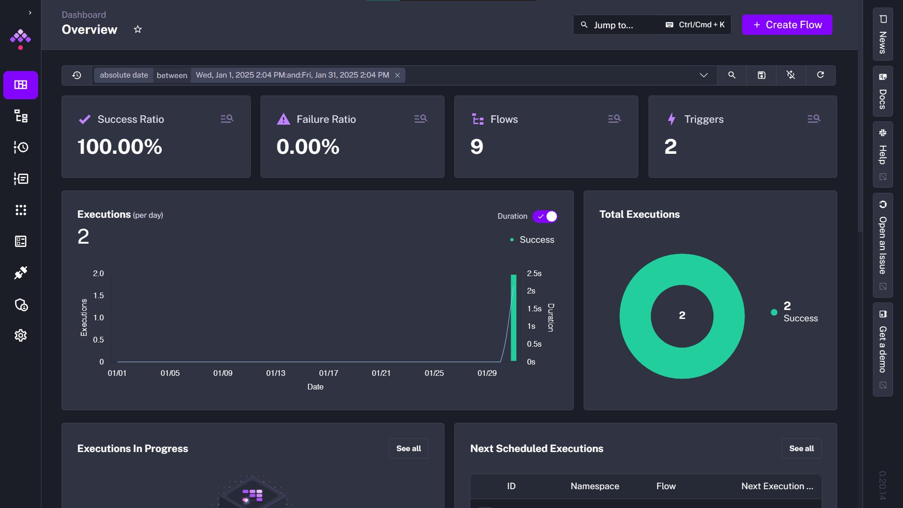
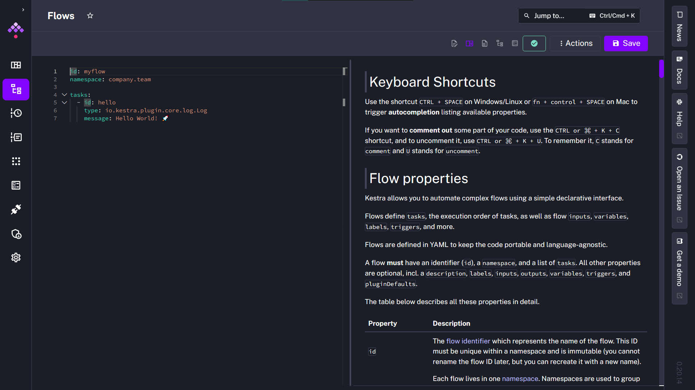
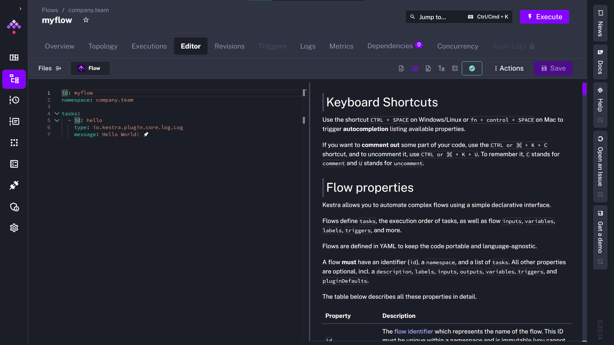
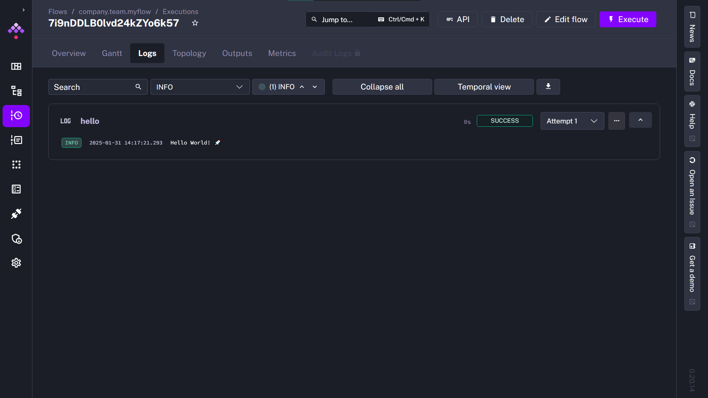

### Table of Contents
* [What is Orchestration](#221---what-is-orchestration)

# Version 2025
## 2.2.1 - Workflow Orchestration Introduction
[](https://www.youtube.com/watch?v=Np6QmmcgLCs)
[](#table-of-contents)

> 協調 (Orchestration) 就像一支音樂管弦樂隊。你有各種不同的樂器——小提琴、喇叭、長笛——每種樂器都發出不同的聲音。它們需要在不同的時間演奏，但有些也需要同時演奏。 
> 
> Orchestration is like a musical orchestra. You have all these different instruments—violins, trumpets, flutes—each making different sounds. They all need to be played at different times, but some also need to be played simultaneously. 

這支影片簡單介紹了 Orchestration 和 Kestra、以及後續將會學到的內容，

## 2.2.2 - Learn Kestra
[](https://www.youtube.com/watch?v=o79n-EVpics)
[](#table-of-contents)

> 這個小節告訴你去哪裡取得 Kestra 的相關資訊，此篇簡單筆記後續執行所需要的資訊。

### 安裝方法

如果你想要[安裝 Kestra](https://kestra.io/docs/getting-started/quickstart) 的話，最簡單的方法是先安裝 Docker。接著運行環境。
```shell
docker run --pull=always --rm -it -p 8080:8080 --user=root -v /var/run/docker.sock:/var/run/docker.sock -v /tmp:/tmp kestra/kestra:latest server local
```
接著在瀏覽器開啟 [http://localhost:8080](http://localhost:8080) 便可以操作 Kestra 的 UI。

### 準備課程環境
如果你要準備下一支 Zoomcamp 影片的操作環境的話，我們需要下載 [DTC 第二周的目錄](https://github.com/DataTalksClub/data-engineering-zoomcamp/tree/main/02-workflow-orchestration) (或者這個 repo 中 module-2 的 kestra-zoomcamp)。接著在目錄下運行：

```shell
docker compose up
```

接著在瀏覽器開啟 [http://localhost:8080](http://localhost:8080) 便可以操作 Kestra 的 UI。

### Kestra 的 Hello World 
<details>

1. 順利啟動 Kestra 後，可以看到以下畫面。



2. 在右上角點擊 `<Create Flow>`，進入建立流程的頁面。這邊我們先什麼都不要編輯，直接點選右上角的 `<Save>` 儲存這個 Flow。



3. 此時畫面右上角頂端的資訊列就會出現 `<Execute>`，代表我們此時可以執行這個流程。點擊 `<Execute>` 跳出執行選項，繼續點選 `<Execute>` 開始執行。



4. Flow 開始執行時就會出現這個 flow 的甘特圖，標示出這個流程的順序及耗時。

|Gannt| Log|
|--|--|
|||

在 log 中可以看到 Flow 執行時的紀錄與相關輸出。這邊出現的 「Hello World! 🚀」就是我們在第 2 步所設置的 task:

```yaml
tasks:
  - id: hello
    type: io.kestra.plugin.core.log.Log
    message: Hello World! 🚀
```
</details>

## 2.2.3 ETL Pipelines with Postgres in Kestra
[](https://www.youtube.com/watch?v=OkfLX28Ecjg)
[](#table-of-contents)

https://kestra.io/docs/installation/docker-compose#networking-in-docker-compose

### 建置環境
1. 搭建這個小節需要的環境，我們需要到 `module-2/kestra-zoomcamp` 目錄下執行
```
docker compose up -d
```
來運行 Kestra 的服務。(你會發現這個 docker-compose 中設定了一個 Postgres 服務作為 Kestra 儲存相關資料的後端)

2. 接著在 `module-2/kestra-zoomcamp/postgres` 目錄下執行
```
docker compose up -d
```
可以開啟我們用以存放資料的 Postgres，和對應的操作介面 pgadmin 二個服務。

> [!NOTE]
> 在這個小節中，Will 透過本機安裝的 pgAdmin 溝通 Postgres 資料庫，而我們透過 Docker 啟用 pgAdmin (跟第一周的方法相似)，也調整了 port 的設定， 因此在這個 repo 中 postgres 的 docker-compose.yml 跟在 zoomcamp repo 的檔案略有不同。

> [!TIP]
> 為什麼我們要調整 port 的設定？
> 在我執行過程中，我發現原本的 `/kestra-zoomcamp/docker-compose.yml` 和 `/postgres/docker-compose.yml`，會因為二個 docker-compose 中的 postgres 都使用 port 5432，Kestra 無法順利找到用來存放 taxi data 的 postgres-db。因此我們將 postgres-db 的 port mapping 由 5432 改為 5431，在後續的 flow 中我們也需要對應調整 plugin 的 url。
>
> 而 Kestra 會占用 port 8080-8081，所以我們將 pgAdmin 的 port 設定為 8082。


```yaml
services:
  postgres:
    image: postgres
    container_name: postgres-db
    # ...
    ports:
      - "5431:5432" # modified from "5432:5432"
    # ...

  pgadmin:
    image: dpage/pgadmin4
    # ...
    ports:
      - "8082:80" # modified from "8080:80"
    volumes:
      - ./servers.json:/pgadmin4/servers.json # import server settings when service is started
```
> [!TIP]
> 我們可以在 docker-compose 中，將 servers.json 掛載 (mount) 到 /pgadmin4/servers.json 這個位置，這樣一來，
> 我們登入 pgAdmin 後就可以單就輸入密碼 (k3str4) 就完成設定資料庫的步驟了。


### Inputs & Variables

在 Kestra 中，我們只需要 YAML 就可以搭建出一個完整的 ETL 流程。首先我們可以利用 `inputs` 定義輸入，定義好的輸入將會變成可以用 jinja 格式取用的變數 `"{{ inputs.<input-id> }}"`，並在 `<Execute>` 介面產生互動的 UI。

`variables` 則定義變數，要取得其中的值則可以透過 jinja 格式搭配 `render()`，也就是 `"{{render(vars.<variable>)}}"`。

釋例如下：
```yaml
id: 02_postgres_taxi
namespace: zoomcamp
description: |
  The CSV Data used in the course: https://github.com/DataTalksClub/nyc-tlc-data/releases

inputs:
  - id: taxi
    type: SELECT
    displayName: Select taxi type
    values: [yellow, green]
    defaults: yellow

  - id: year
    type: SELECT
    displayName: Select year
    values: ["2019", "2020"]
    defaults: "2019"

  - id: month
    type: SELECT
    displayName: Select month
    values: ["01", "02", "03", "04", "05", "06", "07", "08", "09", "10", "11", "12"]
    defaults: "01"

variables:
  file: "{{inputs.taxi}}_tripdata_{{inputs.year}}-{{inputs.month}}.csv"
  staging_table: "public.{{inputs.taxi}}_tripdata_staging"
  table: "public.{{inputs.taxi}}_tripdata"
  data: "{{outputs.extract.outputFiles[inputs.taxi ~ '_tripdata_' ~ inputs.year ~ '-' ~ inputs.month ~ '.csv']}}"
```

### Tasks

在 `tasks` 底下我們可以定義流程。

* staging truncate trick
* md5 key trick
* runif vs. flow.if 

TBD

### pluginDefaults
[`pluginDefaults`](https://kestra.io/docs/workflow-components/plugin-defaults) 定義了 Tasks 或 plugins 的預設值。在這邊，我們將 `host.docker.internal:5432` 改為 `host.docker.internal:5431` 使 Kestra 順利地與 postgres-db 服務溝通。

```yaml
pluginDefaults:
  - type: io.kestra.plugin.jdbc.postgresql
    values:
      url: jdbc:postgresql://host.docker.internal:5431/postgres-zoomcamp # modified
      username: kestra
      password: k3str4

```

## 2.2.4 Manage Scheduling and Backfills with Postgres in Kestra

[](https://www.youtube.com/watch?v=_-li_z97zog)
[](#table-of-contents)


## 2.2.5 Orchestrate dbt Models with Postgres in Kestra
[](https://www.youtube.com/watch?v=ZLp2N6p2JjE)
[](#table-of-contents)


